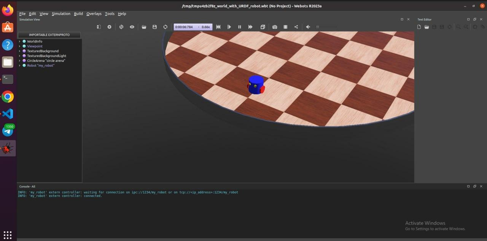
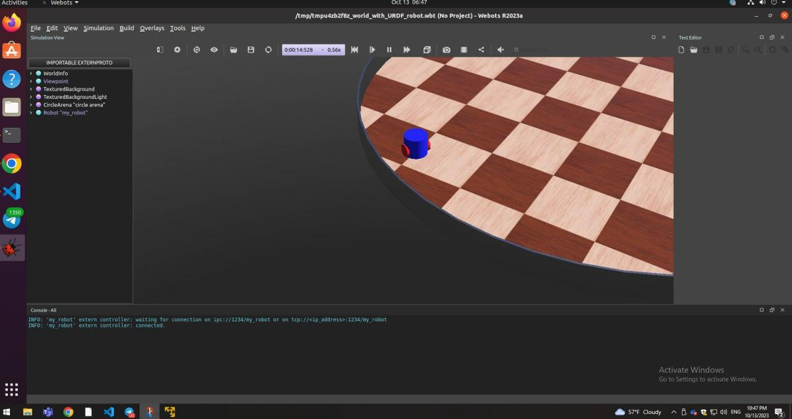
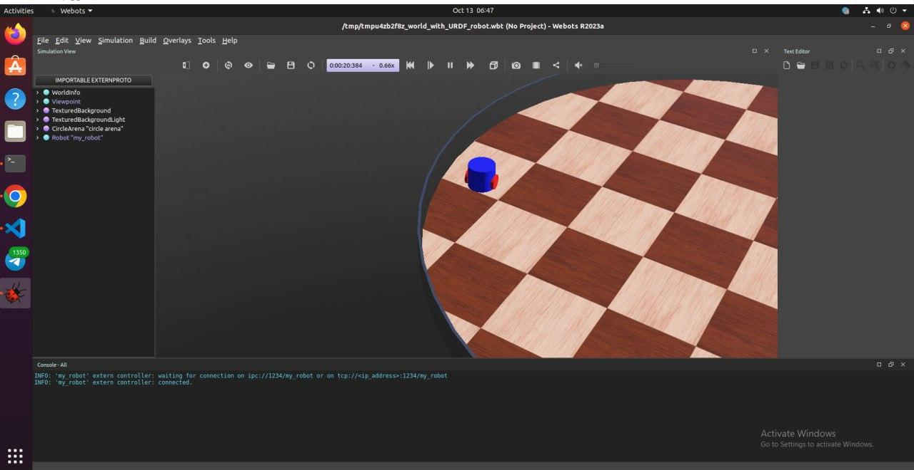

# Video Presentation
[](http://www.youtube.com/watch?v=-FBNOv6xgVc)

#### README - Webots - Obstacle avoiding robot simulation
### 12204505 Guliza Aitkulova


### Code Overview

The code is a ROS (Robot Operating System) package that sets up a robot simulation for obstacle avoidance. It consists of several files:

- `my_robot.urdf`: This file defines the robot's structure and sensors using the URDF (Unified Robot Description Format) XML format.
- `ObstacleAvoider.hpp` and `ObstacleAvoider.cpp`: These files define a class called `ObstacleAvoider` that handles the obstacle avoidance logic. It subscribes to sensor data from the left and right distance sensors and publishes velocity commands to avoid obstacles.
- `CMakeLists.txt`: This file contains the CMake build instructions for the package, including dependencies and installation targets.
- `robot_launch.py`: This file defines the launch configuration for running the simulation. It launches the Webots simulator, the `webots_ros2_driver` node, and the `obstacle_avoider` node.

### Building and Running

To build and run the code, follow these steps:

1. Open a terminal and navigate to the `ros2_ws` directory.
2. Build the package using the following command:
   ```
   colcon build --packages-select my_package
   ```
3. Source the setup script to add the package to the ROS environment:
   ```
   source install/local_setup.bash
   ```
4. Launch the simulation using the following command:
   ```
   ros2 launch my_package robot_launch.py
   ```

### Additional Notes

- Make sure you have ROS 2 and the necessary dependencies installed before building and running the code.
- The launch file `robot_launch.py` assumes the presence of a world file named `my_world.wbt` in the `worlds` directory of the package. Make sure to provide the appropriate world file or modify the launch file accordingly.
- The code assumes the presence of the `webots_ros2_driver` package for interfacing with the Webots simulator. Make sure to install this package before building and running the code.

Here is the output screenshots



